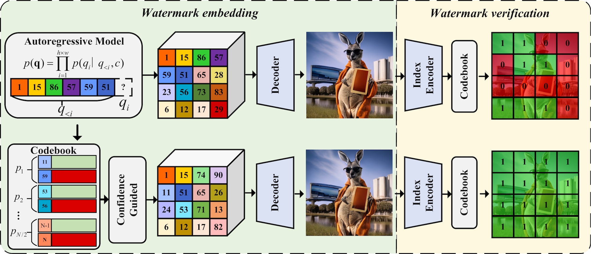

The field of AI image generation is advancing at a remarkable pace, enabling the creation of high-quality, photorealistic images. With many of these generative models being open-sourced, anyone can create diverse, customized content. However, this accessibility also brings the risk of misuse, such as the creation of fake news, challenges in determining content ownership, and the unauthorized use of public figures’ likenesses. A prominent example is the [fabricated images](https://x.com/blovereviews/status/1640029839670517762) of Elon Musk and Alexandria Ocasio-Cortez holding hands, which circulated widely online despite being entirely artificial.

To help distinguish AI-generated content from authentic material, [the Biden administration issued an executive order on October 30, 2023](https://apnews.com/article/biden-ai-artificial-intelligence-executive-order-cb86162000d894f238f28ac029005059). This order mandates the U.S. Department of Commerce to establish guidelines requiring AI-generated content to be watermarked, aiming to foster a safer and more trustworthy digital ecosystem. This underscores the importance of ensuring the safety and responsible use of generative models, as we continue to explore their creative potential.

Generative models are predominantly categorized into diffusion-based and autoregressive approaches. Autoregressive image generation models function in a manner analogous to Large Language Models (LLMs), i.e., synthesizing images through the sequential prediction of subsequent "tokens" (or visual segments). As the domain progresses towards the unification of multimodal content generation, the autoregressive paradigm exhibits considerable potential.

Today, we are excited to share our paper on watermarking for autoregressive image generation models: "[Training-Free Watermarking for Autoregressive Image Generation](https://arxiv.org/pdf/2505.14673)." The paper proposes **IndexMark**, a novel, training-free watermarking approach. Conceived specifically for autoregressive image generation models, IndexMark facilitates user-level traceability of the resultant images. The implemented watermark is imperceptible to human vision yet can be reliably identified via a specialized detection algorithm.

## How IndexMark Works

Autoregressive models determine the next index to be generated by performing a classification over the entries within a codebook. However, these codebooks often exhibit significant redundancy: multiple distinct indices can correspond to highly similar visual vectors.

Leveraging this observation, IndexMark embeds the watermark during the generation process: substituting certain non-watermark tokens (indices) within the image with visually similar watermark tokens. The diagram below illustrates the working principle of this process.

First, we partition the codebook indices into multiple pairs based on similarity, with each pair consisting of two indices. Following this pairing, one index in each pair is randomly designated as a "watermark index" (represented in green), and the other as a "non-watermark index" (represented in red).

Once all tokens (or indices) are generated, non-watermark indices are systematically replaced by their paired watermark indices. This replacement strategy effectively increases the overall proportion of watermark tokens within the generated image. Consequently, the presence of a watermark can be determined by analyzing this proportion of watermark tokens.

## Why Choose IndexMark

We recognize that users select image generation models primarily based on the quality of the output. Consequently, it is paramount that the watermark embedding process does not perceptibly degrade this image quality. This naturally raises the question: is there a significant discernible difference between images with an embedded watermark and their original, non-watermarked counterparts? Our findings indicate that IndexMark has a negligible impact on the visual fidelity of the generated images. See the comparison below.

There are four distinct advantages of IndexMark when compared to existing watermarking methodologies:

1. **Training-Free Implementation:** Firstly, IndexMark does not require any model retraining. This significantly reduces the computational costs and development overhead for model developers.
2. **Preservation of Image Fidelity:** Secondly, IndexMark introduces minimal perceptible changes to the image content. This ensures that user requirements for high-quality outputs are met while concurrently empowering model developers to mitigate the risks of model misuse.
3. **Robustness to Alterations:** Thirdly, IndexMark embeds the watermark within the statistical distribution of the image’s constituent tokens. Consequently, its removal would necessitate substantial and visually disruptive modifications to large portions of the image.
4. **User-Level Traceability:** Finally, by employing varied schemes for designating watermark versus non-watermark indices, distinct identifiers (IDs) can be assigned. This capability allows IndexMark to facilitate user-level image traceability for model developers.

## Summary

The field of autoregressive image generation is experiencing rapid advancements. However, watermarking techniques specifically for autoregressive image models are currently under-explored within the AI community. With autoregressive generation models becoming stronger and stronger, there is an increasing need to develop robust watermarking techniques for these models to ensure the authenticity and traceability of generated images. We believe IndexMark represents a significant step towards ensuring the responsible and secure deployment of autoregressive image generation models.

Paper: https://arxiv.org/pdf/2505.14673.

Code: https://github.com/maifoundations/IndexMark.