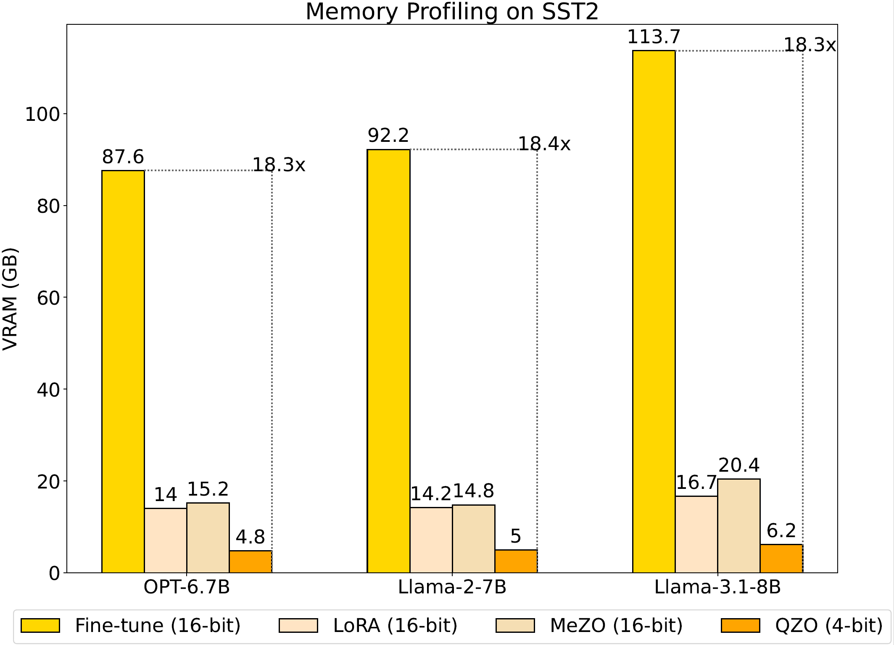

Pre-trained large language models (LLMs) have demonstrated outstanding potential in numerous
downstream applications, ranging from sentiment classification and text summarization, to more
challenging open-ended question answering and creative writing. To fully unlock the potential of LLMs for these downstream tasks, fine-tuning is an essential process. Nevertheless, as the scale of LLM parameters continues to grow exponentially, the enormous cost of computational resources required during fine-tuning becomes a significant challenge, with GPU memory being a major bottleneck. For instance, fine-tuning a Llama-2-7B model stored in BFloat16 requires at least 58GB of GPU memory: 14GB for model weights, 2GB for activations (`#batch_size=1`), 14GB for gradients, and an additional 28GB for optimizer states when using the AdamW optimizer. This memory bottleneck discourages researchers and practitioners with limited computational resources, hindering the democratic use of LLM training.

To tackle the challenge of the tremendous GPU memory cost, researchers have recently proposed *memory-efficient training*, which aims to minimize VRAM usage during LLM training. Although prior works can effectively reduce the VRAM cost of both gradients and optimizer states through low-rank projection or estimation-based methods, the memory challenge incurred by massive model weights still remains unaddressed.

In this blog, we are excited to share with you our recent research work: [Fine-tuning Quantized Neural Networks with Zeroth-order Optimization](https://arxiv.org/pdf/2505.13430). In this work, we proposed a novel memory-efficient training method, *Quantized Zeroth-order Optimization (QZO)*, which saves the total VRAM storage of model weights, gradients, and optimizer states within a unified framework. Our memory profiling experiments demonstrate that QZO could significantly save the total GPU memory cost by more than 18$\times$ compared with regular fine-tuning using AdamW.

## How QZO Works

Our general idea is to eliminate the storage costs of gradients and optimizer states by utilizing zeroth-order optimization, while minimizing the memory requirements of model weights via quantization. Theoretically, this design could reduce the fine-tuning memory footprint to the level of inference for a quantized LLM.

Inspired by a representative work, [MeZO](https://proceedings.neurips.cc/paper_files/paper/2023/file/a627810151be4d13f907ac898ff7e948-Paper-Conference.pdf), we leverage the memory efficiency of *Zeroth-order Optimization (ZO)* to save the storage cost of both gradients and optimizer states. This is enabled by estimating the real gradients using loss values collected from two forward passes and random perturbations applied to model weights.

To push the limits of memory efficiency, we utilize ZO for fine-tuning quantized LLMs, thereby reducing the storage cost of tremendous model weights. However, due to the precision gap between discrete model weights and continuous gradient estimates, quantized LLMs cannot be directly ZO-fine-tuned. To mitigate this issue, we proposed *Quantized Simultaneous Perturbation Stochastic Approximation (Q-SPSA)*, a modified version of the classical algorithm [SPSA](https://www.jhuapl.edu/spsa/PDF-SPSA/Spall_TAC92.pdf), which perturbs the quantization scales and updates them using the corresponding gradient estimates. Q-SPSA enables direct fine-tuning of quantized LLMs, eliminating the need for repeated quantization and de-quantization.

The core of ZO is to reconstruct the gradients using the estimated directional derivative of the loss function with respect to the perturbation vector. In our experiments, we observed that training may collapse when quantization scales are directly updated with their gradient estimates. We attribute this to the high variance of gradient estimates, and thereby designed *Directional Derivative Clipping (DDC)* to clip and threshold the estimated directional derivatives. We provide theoretical proof for variance reduction in the gradient estimates. For more details, interested readers can refer to our original paper.

## Key Findings

We conducted extensive experiments to verify QZO's effectiveness and efficiency. Based on the results, we share the following key findings. 

1. **Effectiveness.** QZO is consistently effective across different LLM architectures (OPT-6.7B, Llama-2-7B, Llama-3-8B) with multiple downstream NLP tasks spanning both classification and generation. 
2. **Memory Efficiency.** Our memory profiling results presented in the bar chart demonstrate that QZO reduces the total VRAM cost by more than **18$\times$** compared with regular fine-tuning with AdamW optimizer and fully sharded data parallel. 
3. **Compute Efficiency.**  The total FLOPs during QZO fine-tuning are approximately **1%** of those required for full parameter fine-tuning methods.
4. **Scalability.** QZO is also compatible with codebook-based extreme quantization methods such as **2-bit** [AQLM](https://arxiv.org/pdf/2401.06118), with which a **Llama-2-13B** model can be fine-tuned using a single Nvidia RTX 4090 (24GB). We have also successfully fine-tuned **Stable Diffusion 3.5 Large** quantized via [BitsAndBytes](https://huggingface.co/docs/transformers/quantization/bitsandbytes) under the same memory budget. The visualization results are presented below.

## Summary

Fine-tuning pretrained LLMs is challenging due to their daunting requirements in GPU memory. Prior research efforts in memory-efficient training effectively address the VRAM usage in gradients and optimizer states, while overlooking the storage cost of model weights. To push the limit of memory efficiency, we propose QZO, which eliminates the storage needs of gradients and optimizer states using zeroth-order optimization, and minimizes the requirement for saving model weights via post-training quantization. We believe that QZO can support researchers and practitioners with limited computational resources, helping to democratize the fine-tuning of large foundational models.

## Resources

- Paper: https://arxiv.org/pdf/2505.13430
- Code: https://github.com/maifoundations/QZO