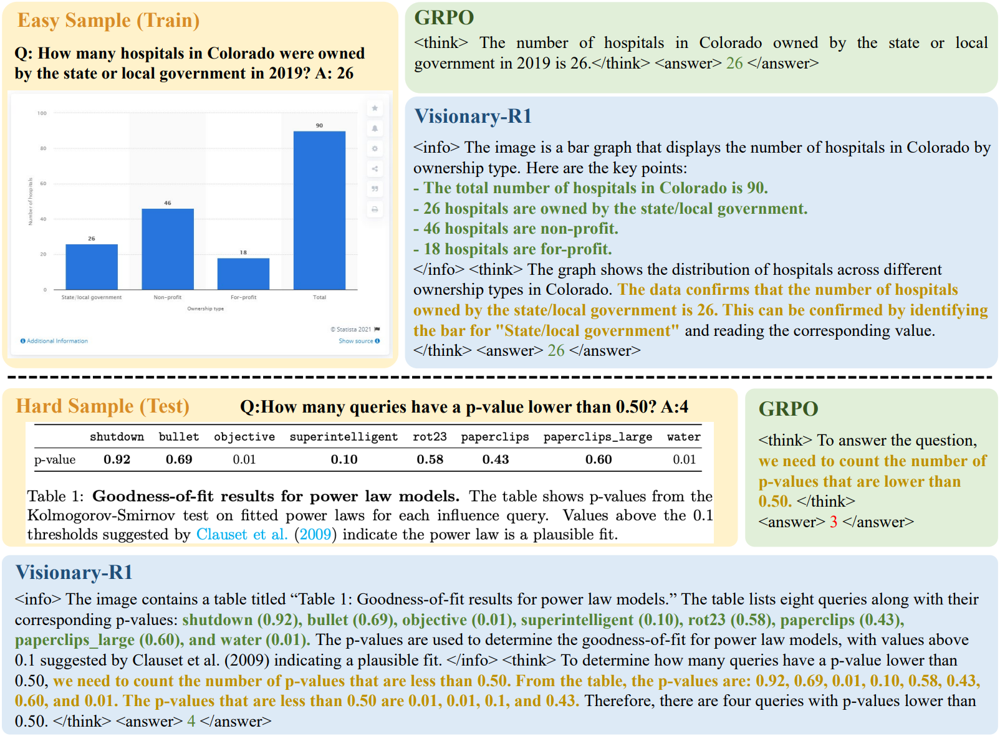
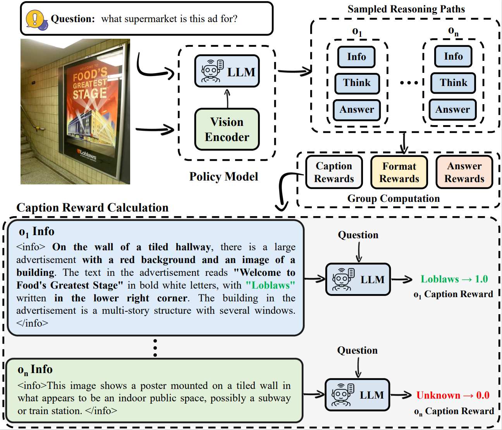

*Shortcut samples earned high rewards but lacked an effective reasoning process, hindering the learning of general reasoning abilities.*

Reasoning is a cornerstone for enabling AI to tackle complex problems and make well-informed decisions in real-world applications. However, training AI models to reason effectively remains a significant challenge. One of the primary obstacles is the lack of large-scale, human-annotated reasoning datasets, which are essential for guiding models during training.

Recent breakthroughs in large language models (LLMs) have opened up new possibilities in this space. For instance, models like [**DeepSeek-R1**](https://github.com/deepseek-ai/DeepSeek-R1) have demonstrated that it's possible to induce reasoning capabilities using reinforcement learning and simple question-answer pairs—without requiring explicit, step-by-step supervision. This represents a significant shift in how we think about training LLMs to reason, making the process more efficient and scalable. Reinforcement learning methods, like **GRPO**, have shown potential for enhancing visual language models (VLMs) by enabling reasoning across modalities. These advances are exciting, but they come with their own set of challenges.

While the idea of training AI models to reason using simple setups may seem promising, it comes with a significant drawback: shortcut learning. This failure mode occurs when the model develops a tendency to produce short, uninformative reasoning chains. These superficial shortcuts often enable the model to correctly answer easy training questions, creating the illusion of success. However, this approach comes at a cost. The model struggles to generalize to more challenging questions that demand genuine visual understanding and deeper reasoning. In essence, the model learns to "game the system" by optimizing for easy wins, rather than truly mastering the underlying complexities of reasoning. This critical failure highlights the need for better training strategies that discourage shortcut learning and encourage models to develop meaningful, robust reasoning capabilities.

To address the issue of shortcut learning in multimodal reasoning models, we are excited to share the [**Visionary-R1**](https://arxiv.org/pdf/2505.14677), a novel reinforcement learning framework designed to enforcing image interpretation before reasoning by following a structured caption–reason–answer format, ensuring deeper visual understanding. This improvement in reasoning depth and generalizability marks a significant step forward in the development of multimodal reasoning models capable of tackling complex, real-world challenges.

## How Visionary-R1 Breaks Shortcuts

We reveal a critical limitation of GRPO when applied to visual language models (VLMs)—the tendency to develop shortcut learning. This finding highlights the need for better training techniques to ensure robust reasoning capabilities. To address the shortcut learning problem, we propose Visionary-R1.

The core component of reinforcement learning involves sampling training data using the policy model. In reasoning tasks, the sampled reasoning paths are evaluated based on the final answer. However, due to the shortcut issue—where the model might produce an answer without proper reasoning or disregard the visual input, relying mainly on textual patterns from the question—the samples with correct answers may fail to provide useful reasoning guidance, thus impeding the model's reasoning abilities.

In the example below, the direct application of GRPO can lead to shortcuts when handling simple samples, as the model can arrive at the correct answer without detailed reasoning. However, this shortcut thinking struggles to generalize to more complex samples, ultimately impairing the model's overall reasoning ability.

The cornerstone of this approach is a structured caption–reason–answer training format, where the model must first generate a detailed caption of the image before proceeding to reasoning and answering the question.

This structured process ensures that the model doesn't rely on superficial cues or patterns, as it often does in traditional setups. Instead, the captioning step forces the model to engage in a deeper analysis of the image context. By requiring detailed captions regardless of whether the question is easy or difficult, the framework encourages the model to adopt a consistent, robust problem-solving approach. This not only mitigates shortcut learning but also enhances the model's ability to generalize across different data distributions.

To further ensure that the captions are meaningful and informative, we apply auxiliary supervision using reinforcement learning from AI feedback. This involves imposing a caption reward, which is combined with standard accuracy and format rewards during policy optimization. The integration of these rewards incentivizes the model to produce captions that are well-structured and contextually rich.

## Findings and Advantages of Visionary-R1

In this paper, we explore how to lower the development costs of training visual language models for reasoning tasks by eliminating the need for chain-of-thought (CoT) supervision. We rely solely on reinforcement learning and paired visual question-answer data. While this approach seems simple and cost-efficient, it reveals a critical failure mode: shortcut learning. The model often develops a tendency to produce short, uninformative reasoning chains, which are sufficient to answer easy training questions correctly. However, this strategy backfires when the model is exposed to harder, unseen questions that require genuine visual understanding.

Compared with existing RL-based reasoning methods, Visionary-R1 has the following key advantages:

1. **SFT-Free**:  One major limitation of current multimodal reasoning models is their reliance on complex, multi-stage training pipelines. These pipelines are not only computationally expensive but also time-intensive, which restricts their accessibility. Visionary-R1 leverages a pure Reinforcement Learning training process, making it a single-stage, SFT-Free method. This approach extensively simplifies the training process by eliminating the need for Supervised Fine-Tuning, thereby reducing both the computational load and the time required for model development.

2. **CoT-Free**: Additionally, many of these models depend heavily on labeled chain-of-thought reasoning data distilled from proprietary systems like GPT-4o. Visionary-R1, however, operates without the need for such chain-of-thought data, promoting a more open and accessible approach to multimodal reasoning. By removing this dependency, it encourages collaborative advancements and ensures that research findings can be more easily shared and validated across the community.

3. **Better Scalability**: Visionary-R1 is designed with scalability in mind, allowing it to efficiently adapt to larger datasets and more complex tasks without a corresponding increase in resource requirements. Its single-stage training process enable it to scale effectively, making it suitable for a wide range of applications. Not dependent on CoT data ensures that as data grows, Visionary-R1 can continue to deliver high performance without necessitating CoT annotation or substantial computational investments.

## Summary

We highlight the shortcut learning problem encountered when applying reinforcement learning to visual language models. Unlike large language models, VLMs are significantly more challenging to train for reasoning without relying on annotated data. Through our proposed model, Visionary-R1, we demonstrate that even without using chain-of-thought annotations and relying solely on question-answer pairs, it is possible to achieve strong performance on challenging reasoning benchmarks. Visionary-R1 surpasses several commercial AI models, which likely benefit from larger-scale, higher-quality training datasets. These results underscore the importance of understanding image context through captioning as a foundational step for improving reasoning in VLMs.

## Resources
- Paper: https://arxiv.org/pdf/2505.14677.
- Code: https://github.com/maifoundations/Visionary-R1.
- Model: https://huggingface.co/maifoundations/Visionary-R1.